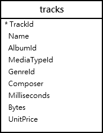

## Simple uses of SELECT statement

You can use the SELECT statement to perform a simple calculation as follows:

```SELECT 1 + 1;```

```SELECT 
   10 / 5, 
   2 * 4 ;
```
### Querying data from a table using the SELECT statement
The syntax of the SELECT statement is as follows:

```SELECT DISTINCT column_list
FROM table_list
  JOIN table ON join_condition
WHERE row_filter
ORDER BY column
LIMIT count OFFSET offset
GROUP BY column
HAVING group_filter;
```

The SELECT statement is the most complex statement in SQLite. To help easier to understand each part, we will break the SELECT statement into multiple easy-to-understand tutorials.

Use ```ORDER``` BY clause to sort the result set\
Use ```DISTINCT``` clause to query unique rows in a table\
Use ```WHERE``` clause to filter rows in the result set\
Use ```LIMIT OFFSET``` clauses to constrain the number of rows returned\
Use ```INNER JOIN``` or ```LEFT JOIN``` to query data from multiple tables using join\
Use ```GROUP BY``` to get the group rows into groups and apply aggregate function for each group\
Use ```HAVING``` clause to filter groups\

```SELECT column_list
FROM table;
```
Even though the SELECT clause appears before the FROM clause, SQLite evaluates the FROM clause first and then the SELECT clause, therefore:

First, specify the table where you want to get data from in the FROM clause\
Notice that you can have more than one table in the FROM clause\
Second, specify a column or a list of comma-separated columns in the SELECT clause\
You use the semicolon (;) to terminate the statement

### SQLite SELECT examples
Let’s take a look at the tracks table in the sample database\
The tracks table contains columns and rows\
It looks like a spreadsheet

<!--  --->

https://github.com/CageNic/perl_explained/blob/main/database/tracks_table.png

Tracks Table data
To get data from the tracks table such as trackid, track name, composer, and unit price, you use the following statement:

```SELECT
	trackid,
	name,
	composer,
	unitprice
FROM
	tracks;
 ```
You specify a list column names, which you want to get data, in the SELECT clause and the tracks table in the FROM clause\
SQLite returns the following result:

Tracks Table partial data
To get data from all columns, you specify the columns of the tracks table in the SELECT clause as follows:

```SELECT
	trackid,
	name,
	albumid,
	mediatypeid,
	genreid,
	composer,
	milliseconds,
	bytes,
	unitprice
FROM
	tracks;
```

For a table with many columns, the query would be so long that time-consuming to type. To avoid this, you can use the asterisk (*), which is the shorthand for all columns of the table as follows:

```SELECT * FROM tracks;```

The query is shorter and cleaner now

However…

You should use the asterisk (*) for the testing purpose only, not in the real application development

Because…
When you develop an application, you should control what SQLite returns to your application\
Suppose, a table has 3 columns, and you use the asterisk (*) to retrieve the data from all three columns\
What if someone removes a column, your application would not be working properly, because it assumes that there are three columns returned and the logic to process those three columns would be broken\
If someone adds more columns, your application may work but it gets more data than needed, which creates more I/O overhead between the database and application\
So try to avoid using the asterisk (*) as a good habit when you use the SELECT statement
